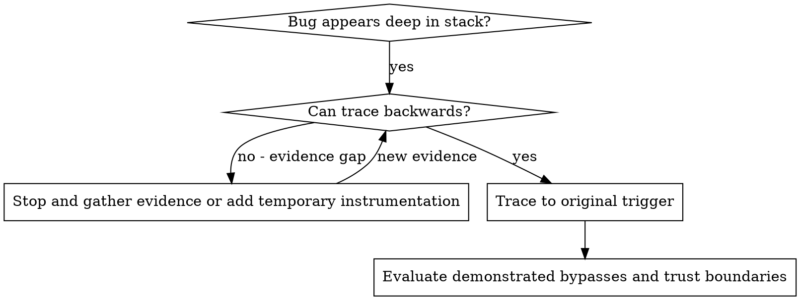
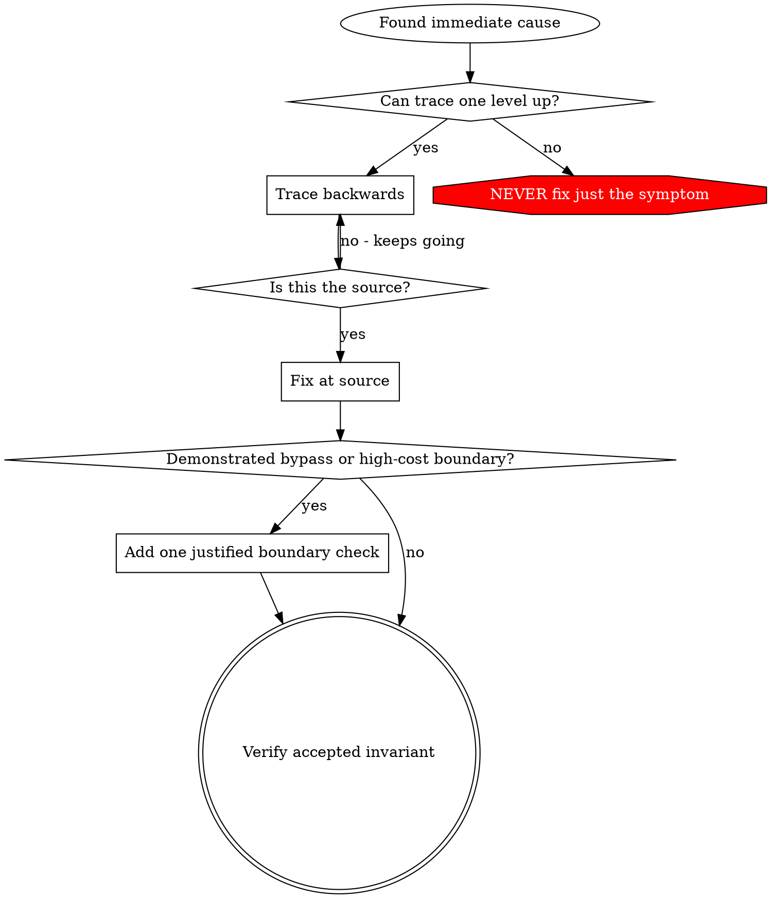

# Root Cause Tracing

## Overview

Bugs often manifest deep in the call stack (git init in wrong directory, file created in wrong location, database opened with wrong path). Your instinct is to fix where the error appears, but that's treating a symptom.

**Core principle:** Trace backward through the call chain until you find the original trigger, then fix at the source.

## When to Use



**Use when:**
- Error happens deep in execution (not at entry point)
- Stack trace shows long call chain
- Unclear where invalid data originated
- Need to find which test/code triggers the problem

## The Tracing Process

### 1. Observe the Symptom
```
Error: git init failed in ~/project/packages/core
```

### 2. Find Immediate Cause
**What code directly causes this?**
```typescript
await execFileAsync('git', ['init'], { cwd: projectDir });
```

### 3. Ask: What Called This?
```typescript
WorktreeManager.createSessionWorktree(projectDir, sessionId)
  → called by Session.initializeWorkspace()
  → called by Session.create()
  → called by test at Project.create()
```

### 4. Keep Tracing Up
**What value was passed?**
- `projectDir = ''` (empty string!)
- Empty string as `cwd` resolves to `process.cwd()`
- That's the source code directory!

### 5. Find Original Trigger
**Where did empty string come from?**
```typescript
const context = setupCoreTest(); // Returns { tempDir: '' }
Project.create('name', context.tempDir); // Accessed before beforeEach!
```

## Adding Temporary Trace Markers

When manual tracing stalls, add the smallest redacted marker at the suspected boundary:

```typescript
async function gitInit(directory: string) {
  console.error('DEBUG git-init-boundary', {
    correlationId: 'investigation-1',
    stage: 'workspace-manager',
    directoryPresent: directory.length > 0,
    directoryIsAbsolute: isAbsolute(directory),
    matchesExpectedRoot: directory.startsWith(expectedTestRoot),
  });

  await execFileAsync('git', ['init'], { cwd: directory });
}
```

Use synthetic IDs, stage names, booleans, counts, shapes, and exit status. Never dump raw paths, environment variables, payloads, credentials, personal data, or full stacks into logs/transcripts. Run the focused reproduction, identify the failing boundary, then remove the marker unless an existing observability contract owns it.

## Finding Which Test Causes Pollution

If something appears during tests but you don't know which test:

Use the bisection script `find-polluter.sh` in this directory:

```bash
./find-polluter.sh '.git' 'src/**/*.test.ts'
```

Runs tests one-by-one, stops at first polluter. See script for usage.

## Real Example: Empty projectDir

**Symptom:** `.git` created in `packages/core/` (source code)

**Trace chain:**
1. `git init` runs in `process.cwd()` ← empty cwd parameter
2. WorktreeManager called with empty projectDir
3. Session.create() passed empty string
4. Test accessed `context.tempDir` before beforeEach
5. setupCoreTest() returns `{ tempDir: '' }` initially

**Root cause:** Top-level variable initialization accessing empty value

**Fix:** Made tempDir a getter that throws if accessed before beforeEach

**Additional checks in this example:** Evidence showed independent entry, business-logic, and test-environment bypasses, so those boundaries received focused validation. Stack tracing was temporary investigation instrumentation and should be removed unless an existing observability contract requires it.

## Key Principle



**NEVER fix just where the error appears.** Trace back to find the original trigger.

## Trace-Marker Tips

**Before operation:** Observe the selected boundary before the dangerous operation, not after it fails.
**Minimize:** Record only the redacted property needed to distinguish current hypotheses.
**Correlate:** Use a synthetic run/stage identifier rather than user, path, or payload values.
**Remove:** Delete temporary instrumentation after localization unless permanent observability is already part of the accepted contract.

## Real-World Impact

From debugging session (2025-10-03):
- Found root cause through 5-level trace
- Fixed at source (getter validation)
- Added the independently justified boundary checks found by the investigation
- 1847 tests passed, zero pollution
