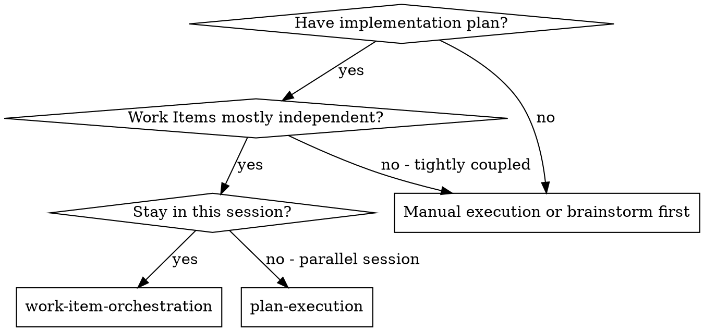
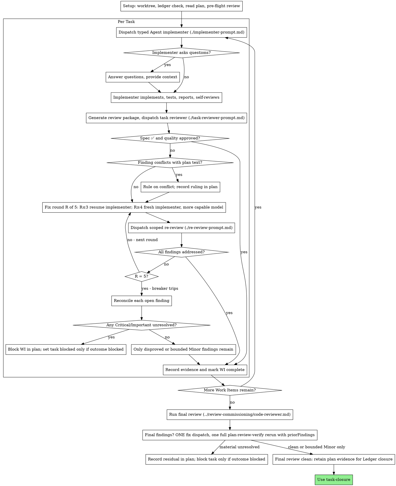

# Subagent-Driven Development

Execute the active plan by dispatching a fresh typed `Agent` implementer per Work Item, an independent review (spec compliance + code quality) after each, and a broad whole-change review at the end.

**Why Agent children:** You delegate Work Items to typed agents with isolated context. By precisely crafting their instructions and context, you ensure they stay focused and succeed. They receive a self-contained handoff rather than the root session's history, preserving root context for coordination.

**Core principle:** Fresh implementer per Work Item + Work-Item review (spec + quality) + broad final review = high quality, fast iteration

**Narration:** between tool calls, narrate at most one short line — the ledger and the tool results carry the record.

## Ledger State: Orchestration And Execution

The root session orchestrates; each typed implementer executes exactly one Work Item. The task, active records, plan, brief, and recorded comparison base are the handoff—not the controller's conversation. Implementer reports remain claims until the independent Work-Item review checks the complete BASE-to-worktree package. The controller alone reconciles plan state/remediation, implementation and review evidence notes, blocking owners, follow-up ownership, and task closure.

**Continuous execution:** Do not pause to check in with the operator between tasks. Execute all tasks from the plan without stopping. The only reasons to stop are the four named below, or all tasks complete. "Should I continue?" prompts and progress summaries waste their time — they asked you to execute the plan, so execute it.

**Rulings within authority.** A running plan should not stall on reversible implementation mechanics that active records leave open. Choose the smallest coherent option, record `Ruling: <what you decided> — <why> — <what it costs if wrong>` in the active plan, link any supporting evidence or decision, and continue. The task and active decisions, plus an active specification when present, are binding semantic authority; the plan is their implementation argument. A ruling cannot invent product behavior, data meaning, permissions, lifecycle, external effects, or acceptance.

Five classes stop execution: an irreversible or destructive operation; a security-sensitive action; a side effect outside this worktree that requires authority (such as merge, push, or publish); an unresolved assumption that could change behavior or acceptance; and a plan so broken that every path forward is a guess. Record the blocking owner and execution effect in the active plan, link supporting evidence/research/decision records, and return the question to shaping. Set task Status to `blocked` only when the condition blocks the task outcome.

## When to Use



**vs. Executing Plans (parallel session):**
- Same session (no context switch)
- Fresh typed `Agent` implementer per Work Item (no context pollution)
- Review after each task (spec compliance + code quality), broad review at the end
- Faster iteration (no human-in-loop between tasks)

## The Process



## Setup

Ensure the work happens in an isolated workspace: use `workspace-isolation` to create one or verify the existing one. The operator owns branch and worktree creation when the current environment has not already established them.

Read `.ledger/INDEX.md`, the governing `task.md`, the active plan, and every active referenced specification and decision. Confirm implementation authorization, dependency readiness, and that no referenced record still blocks the selected Work Item. Set task Status to `active` when execution begins and the plan's selected Work Item to `active`.

Conversation memory does not survive compaction. In real sessions, controllers that lost their place have re-dispatched completed Work Item sequences. The active plan's `WI-###` state and evidence links, the linked implementation/review evidence notes, and current repository state are the recovery map. Trust those records over recollection.

Each plan owns an artifact directory under its Ledger bundle. Run `scripts/sdd-workspace PLAN_FILE`; it validates that the plan lives under `.ledger/<task-id>/plans/` and prints `.ledger/<task-id>/evidence/sdd/<plan-basename>/`. Briefs, reports, and review packages for this plan stay there. Work Item progress remains in the active plan; observations and reports remain under `evidence/`.

Read the plan once, note its context and Global Constraints, and reconcile its Work Items against task Acceptance Criteria. If the plan names a specification, read it; if it declares `Spec: None`, verify the task and active decisions supply the contract and that no meaningful behavior, invariant, error handling, or failure semantics require a separate specification. A missing named specification is blocking, not a provisional journal entry.

Before dispatching WI-001, scan the plan once for conflicts, writing down what you checked as you check it:

- Work Items that contradict each other or the plan's Global Constraints;
- anything the plan explicitly mandates that the review rubric treats as a defect.

The scan's output is a table, not a verdict. One row for every pair of Work Items that share a file or interface: the two Work Items, what one produces against what the other consumes, and what you found. One row for every Work Item: whether its own text agrees with itself. "The scan is clean" without those rows is not a scan you ran.

Record the table in the active plan. Resolve each conflict before execution—the task, active specification when present, and decisions are binding authority; the plan is their implementation argument. Consequential choices go under `decisions/`; execution implications and replanning remain in the plan. Then dispatch WI-001. The review loop remains the net for conflicts that only emerge from implementation.

## Model Selection

Use the least powerful model that can handle each role to conserve cost and increase speed.

**Mechanical implementation tasks** (isolated functions, clear specs, 1-2 files): use a fast, cheap model. Most implementation tasks are mechanical when the plan is well-specified.

**Integration and judgment tasks** (multi-file coordination, pattern matching, debugging): use a standard model.

**Architecture and design tasks**: use the most capable available model.
The final whole-branch review is one of these — dispatch it on the most
capable available model, not the session default.

**Review tasks**: choose the model with the same judgment, scaled to the
diff's size, complexity, and risk. A small mechanical diff does not need the
most capable model; a subtle concurrency change does. Scoped re-reviews of
small fix diffs take a cheap-to-mid tier.

**Fix-loop escalation (rounds 4-5)**: use a model at least one tier above
the implementer that got stuck.

**Always specify the profile explicitly when dispatching `Agent`.** An omitted profile inherits the configured agent profile, which may not match the Work Item. Profiles select model/thinking policy; the `Implement` type supplies the role and capabilities.

**Turn count beats token price.** Wall-clock and context cost scale with how
many turns a subagent takes, and the cheapest models routinely take 2-3× the
turns on multi-step work — costing more overall. Use a mid-tier model as the
floor for reviewers and for implementers working from prose descriptions.
When the task's plan text contains the complete code to write, the
implementation is transcription plus testing: use the cheapest tier for
that implementer. Single-file mechanical fixes also take the cheapest tier.

**Task complexity signals (implementation tasks):**
- Touches 1-2 files with a complete spec → cheap model
- Touches multiple files with integration concerns → standard model
- Requires design judgment or broad codebase understanding → most capable model

## The Task Loop

**Batch small same-shape work.** When the plan lists several tasks that are
each a small, independent edit of the same kind — the same one-line fix,
constant change, or field addition repeated across files — do not dispatch
one subagent per task. Compose ONE dispatch brief listing every file and
its change, send the whole batch to a single subagent, and review its diff
as one unit. Reserve one-dispatch-per-task for work that needs its own
judgment, its own tests, or its own review surface.

Everything you paste into a dispatch prompt — and everything a subagent
prints back — stays resident in your context for the rest of the session
and is re-read on every later turn. Hand artifacts over as files.

**Waiting on dispatched subagents:** never poll a wait interface with
short timeouts, and never sit in one silent, open-ended wait either.
While you have local work — ledger updates, packaging the next review,
reading reports — keep working; child results arrive on their own.
When you are genuinely idle, wait in bounded stretches (five to ten
minutes, where your platform allows), and between stretches post one
line of status and reconcile your live children: list them, and chase
any that finished without reporting. A bounded stretch keeps nearly
all of a long wait's efficiency while guaranteeing a stuck or lost
child is noticed within minutes, not at the end of the session.

### 1. Dispatch the implementer

Record BASE (`git rev-parse HEAD`) before dispatching. The review package captures the current worktree diff against this unchanged boundary.

- **Task brief:** before dispatching an implementer, run this skill's
  `scripts/task-brief PLAN_FILE WI_ID` — it extracts the task's full text to a
  uniquely named file and prints the path. Compose the dispatch so the
  brief stays the single source of
  requirements. Your dispatch should contain: (1) one line on where this
  task fits in the project; (2) the brief path, introduced as "read this
  first — it is your requirements, with the exact values to use verbatim";
  (3) interfaces and decisions from earlier tasks that the brief cannot
  know; (4) your resolution of any ambiguity you noticed in the brief;
  (5) the report-file path and report contract. Exact values (numbers,
  magic strings, signatures, test cases) appear only in the brief. Never
  make a subagent read the whole plan file.
- **Report file:** name the implementer's report file after the brief
  (brief `…/WI-###-brief.md` → report `…/WI-###-report.md`) and put it in
  the dispatch prompt. The implementer writes the full report there and
  returns only status, changed paths, a one-line test summary, and concerns.
- A dispatch prompt describes one task, not the session's history. Do not
  paste accumulated prior-task summaries ("state after Tasks 1-3") into
  later dispatches — a real session's dispatch hit 42k chars of which 99%
  was pasted history. A fresh subagent gets the brief, active plan path, the interfaces it touches, global constraints, and only the relevant prior evidence paths. Nothing else.
- The dispatch carries the no-subagents contract (it is in the
  implementer template): the implementer never dispatches subagents —
  not helpers, and never a reviewer. Review arrives from you, after the
  report. In real sessions, every reviewer a worker spawned duplicated
  the task review the controller dispatched anyway — a full extra
  review seat per task.
- If an earlier Work Item deferred a bounded Minor finding in the area this Work Item touches, carry the owning review evidence path and observation ID in the dispatch.
- Record the implementer's agent identity from the dispatch result —
  fix-loop rounds 1-3 resume this agent.
- Never dispatch multiple implementation subagents in parallel (conflicts).

Dispatch with the real `Agent` tool using `subagent_type: "Implement"`, an explicit profile, `inherit_context: false`, and the handoff contract in [implementer-prompt.md](implementer-prompt.md).

### 2. Handle the report

Implement Agent children report one of four statuses. Handle each appropriately:

**DONE:** Generate the review package (`scripts/review-package PLAN_FILE BASE`, from this skill's directory — it prints the Ledger-owned file path containing the complete BASE-to-worktree change, including non-ignored untracked text and binary files), then dispatch the task reviewer with the printed path.

**DONE_WITH_CONCERNS:** The implementer completed the work but flagged doubts. Read the concerns before proceeding. If the concerns are about correctness or scope, address them before review. If they're observations (e.g., "this file is getting large"), note them and proceed to review.

**NEEDS_CONTEXT:** The implementer needs information that wasn't provided. Provide the missing context and re-dispatch.

**BLOCKED:** The implementer cannot complete the task. Assess the blocker:
1. If it's a context problem, provide more context and re-dispatch with the same model
2. If the task requires more reasoning, re-dispatch with a more capable model
3. If the task is too large, break it into smaller pieces
4. If the plan itself is wrong, record the correction ruling and replanning effect in the active plan, link its evidence or decision owner, and re-dispatch with the ruling carried in the dispatch

**Never** ignore an escalation or force the same model to retry without changes. If the implementer said it's stuck, something needs to change.

If the implementer asks questions — before starting or mid-task — answer
clearly and completely, provide additional context if needed, and don't
rush it into implementation.

### 3. Review the task

Per-task reviews are task-scoped gates. The broad review happens once, at the
final whole-branch review. Never skip the task review, and never accept a
report missing either verdict — spec compliance AND task quality are both
required. Implementer self-review never replaces the task review; both are
needed.

- Hand the reviewer its change as a file: run this skill's `scripts/review-package PLAN_FILE BASE` and pass the printed path. The output never enters your own context. The reviewer sees tracked status and patches plus every non-ignored untracked file patch, including binary patches, in one Read call. Use the BASE recorded before dispatching the implementer. Never dispatch a task reviewer without this package; plain `git diff` omits untracked files.
- **Reviewer inputs:** the task reviewer gets the active plan path, same brief, report file, review package, and only the prior evidence paths relevant to the Work Item, plus the global constraints that bind it.
- The global-constraints block you hand the reviewer is its attention
  lens. Copy the binding requirements verbatim from the plan's Global
  Constraints section or the spec: exact values, exact formats, and the
  stated relationships between components ("same layout as X", "matches
  Y"). The reviewer's template already carries the process rules (YAGNI,
  test hygiene, review method) — the constraints block is for what THIS
  project's spec demands.
- Do not add open-ended directives like "check all uses" or "run race tests
  if useful" without a concrete, task-specific reason
- Do not ask a reviewer to re-run tests the implementer already ran on the
  same code — the implementer's report carries the test evidence
- Do not pre-judge findings for the reviewer — never instruct a reviewer to
  ignore or not flag a specific issue. If you believe a finding would be a
  false positive, let the reviewer raise it and adjudicate it in the review
  loop. If the prompt you are writing contains "do not flag," "don't treat X
  as a defect," "at most Minor," or "the plan chose" — stop: you are
  pre-judging, usually to spare yourself a review loop.
The task reviewer may report "⚠️ Cannot verify from diff" items — requirements
that live in unchanged code or span tasks. These do not block the rest of the
review, but you must resolve each one yourself before marking the Work Item
complete in the active plan: you hold the plan and cross-Work-Item context the reviewer
lacks. If you confirm an item is a real gap, treat it as a failed spec
review — it enters the fix loop with the other findings.

Load `review-commissioning`, then use its executable review gate in `work-item` mode. Translate [task-reviewer-prompt.md](task-reviewer-prompt.md) into the gate inputs, include the brief, report, unique review package, and global constraints in `contextPaths`, and use the actual `WI-###` as `workItem`.

Before routing findings, assign or retain each observation's stable `OBS-WI-###-NN` ID and record it in the Work Item review evidence note with calibrated severity, trigger/evidence/impact, and `status: open`. Every later re-review verdict records one disposition for that ID (`resolved`, `rejected`, bounded `Minor deferred`, or `material unresolved`) in the same evidence note or links it to a new owned Ledger task. Track resulting remediation and blocking state in the active plan. Fix-round counts never replace per-observation state.

**Severity mapping:** task-reviewer `Critical`/`Important` and whole-change `review` `critical`/`significant` are material and block while unresolved. Only calibrated `Minor`/`minor` findings can use the bounded-Minor path.

### 4. The fix loop

The loop triggers when the review reports spec ❌, any Critical or Important
finding, or a ⚠️ item you confirmed as a real gap.

Before the loop starts, two routes leave it immediately:

- Record Minor findings in the Work Item review evidence note as you go:
  `WI-###: Disposition: Minor deferred — OBS-WI-###-NN — <finding> — <impact, owner, revisit condition>`.
  Point the final whole-branch review at every disposition in those evidence notes so it can
  triage which must be fixed before merge. A roll-up nobody reads is a silent
  discard. Minor findings never enter the loop.
- A finding labeled plan-mandated — or any finding that conflicts with
  what the plan's text requires — is yours to rule on: weigh the finding
  against the governing task/specification/decisions, record the ruling and its execution effect in the active plan, and link the relevant review evidence before you act on it. Do not dismiss the finding because
  the plan mandates it, and do not dispatch a fix that contradicts the plan
  without a recorded ruling.
Everything else enters the loop. A fix round is one fix dispatch plus one
scoped re-review. Five rounds maximum per task:

**Rounds 1-3 — resume the original implementer.** Send it the open findings
verbatim with the active plan and owning review evidence path. Its context is intact: it knows the task, the code, and its own
choices. If your harness cannot send another message to a live subagent,
dispatch a fresh implementer carrying the active plan, owning review evidence, brief, report-file path,
and findings—the plan/evidence/report files are the persistent memory.

**Rounds 4-5 — dispatch a fresh implementer on a more capable model** (per
Model Selection), with the active plan, owning review evidence, brief path, report-file path, open
findings, and this framing: "A prior implementer attempted this task
[N] times; you own it now. Read the report file for what was tried." A loop
that survives three resumes usually means the implementer cannot see its
own problem — fresh eyes and a capability bump in one move.

**Every round, either way:** the implementer fixes, re-runs the tests
covering the amended code, appends its fix report to the same report file,
and returns the short contract. Before re-dispatching the reviewer, confirm
the fix report contains the covering tests, the command run, and the
output; dispatch the re-review once all three are present. Name the
covering test files in the fix message — a one-line fix does not need the
whole suite.

**The re-review is scoped.** Regenerate `scripts/review-package PLAN_FILE BASE` and run the executable review gate in `fix` mode. Pass the Work Item review evidence note's complete open observation objects as typed `priorObservations` JSON; translate [re-review-prompt.md](re-review-prompt.md) into the gate checks and include the active plan, owning review evidence note, brief, report file, and fresh BASE-to-worktree package in `contextPaths`. The re-reviewer verdicts each finding ADDRESSED or NOT ADDRESSED and uses the appended fix report to inspect amended paths for new breakage. New Critical/Important breakage attributable to those amendments joins the review evidence note. Calibrate unrelated observations independently and assign an `OBS-WI-###-NN` ID: record bounded-Minor and material-unresolved dispositions in that evidence note. A real independent Critical/Important defect gets a new owned Ledger task. When the current Work Item or downstream work relies on the broken behavior, set the Work Item `blocked` in the active plan and record the blocking owner there; change task Status to `blocked` only when the task-level blocking predicate is actually met. Location outside the fix diff never downgrades severity.

**After each round,** update remediation/progress in the active plan and append the round observation to the Work Item review evidence note:
`WI-###: fix round <R>/5 (<X> addressed, <Y> open — <finding one-liners>; changed paths <paths>)`

Never fix findings yourself in the controller session — your context stays
clean for coordination, and controller fixes skip review.

**The breaker.** When round 5's re-review still leaves findings open, stop
dispatching and reconcile each candidate against the governing contract and
current source:

Record each breaker disposition in the Work Item review evidence note and reconcile its execution effect in the active plan:

- **Disproved:** `WI-###: Disposition: rejected — <observation id> — <finding> — <trigger/evidence>`. A controller preference is not disproof.
- **Confirmed Minor with bounded impact:** defer it only when it does not
  violate an Acceptance Criterion or feed dependent work: `WI-###: Disposition: Minor deferred — <observation id> — <finding> — <impact, owner, revisit condition>`.
- **Confirmed or unresolved Critical/Important:** set the Work Item `blocked` in the active plan and record `WI-###: Disposition: material unresolved — <observation id> — <finding> — <evidence or authority needed>` in review evidence. Set task Status to `blocked` only when the unresolved condition blocks the task outcome. If it exposes a plan or product-semantics gap,
  return to shaping. A retry cap never converts material uncertainty into
  completion.

Reconcile only at the cap. Doing it earlier to end a loop is pre-judging with
a different name. Every disposition remains in the review evidence note and every execution consequence remains in the plan; silent discard is forbidden.

### 5. Complete the task

Set the plan's Work Item to `complete` only when review is clean, every candidate is
disproved, or the only remaining findings are explicitly bounded Minor items. Link the implementation and review evidence notes and record one completion summary in the plan:

- `WI-###: complete (review clean; checks <commands>)`
- `WI-###: complete (<K> bounded Minor findings; checks <commands>)`

Move on only after every `OBS-WI-###-NN` has a durable disposition in review evidence or an owned follow-up task. Any confirmed or unresolved material finding keeps the Work Item blocked in the plan.

## Final Review

The final whole-branch review gets a package too: run
`scripts/review-package PLAN_FILE MERGE_BASE` (MERGE_BASE = the commit the
branch started from, e.g. `git merge-base main HEAD`) and include the
printed path in the final review context. Use `review`'s full
`plan-review-verify.js` topology—not the bounded Ledger gate—so a fresh planner covers every changed path, focused read-only reviewers investigate the partitions, and a deep verifier reconciles findings and coverage gaps. Adapt review-commissioning's
`review-commissioning`'s `code-reviewer.md` into the planner/reviewer/verifier prompts. Point it at every Work Item review evidence note containing dispositions so it can triage which must be fixed before merge.

If the final whole-branch review returns findings, dispatch ONE fix subagent
with the active plan, final-review evidence path, and complete findings list—not one fixer per finding.
Per-finding fixers each rebuild context and re-run suites; a real
session's final-review fix wave cost more than all its tasks combined.
Then regenerate `scripts/review-package PLAN_FILE MERGE_BASE` and run one fresh
full `review` `plan-review-verify.js`
cycle over every changed path. Pass the prior final findings through
`inputs.priorFindings` as JSON objects containing stable `candidateId`, title,
severity, path, trigger, evidence, impact, recommendation, stored `scope`, and
boolean `loadBearing`; live out-of-scope findings also carry `suggestedOwner`
and `revisitCondition`. Preserve this classification independently of whether
the original path is currently changed. Require `priorDecisionCoverage.complete`
and one `priorDisposition` (`addressed`,
`open`, `rejected`, or `unresolved`) per stable prior ID while also closing
changed-path and focus coverage. Do not route this branch-wide fix through the
bounded Work-Item `fix` gate or [re-review-prompt.md](re-review-prompt.md).
There is no second fix wave: confirmed or unresolved `review`
critical/significant findings are material, block completion, and are surfaced
with their exact evidence/authority need; only disproved candidates or bounded
Minor findings may proceed to `task-closure`.

## Finish

Before you delete anything, collect every plan ruling and every review-evidence disposition—rejected candidates, deferred Minor findings, and material blockers—into your final message under "Rulings and dispositions", in chronological order, each with what it costs if wrong. The
list is exhaustive: if the Ledger holds either stable marker, the list includes
it. A decision that dies with the workspace was made in secret.

Keep this plan's briefs, reports, and review packages in its Ledger evidence directory until the task is archived. `task-closure` decides what durable outcomes leave the task bundle; Git history is not a substitute for task acceptance evidence.

Use task-closure.

## Common Rationalizations

| Excuse | Reality |
|--------|---------|
| "Close enough on spec compliance" | Reviewer found spec gaps = not done. Fix or hit the cap and adjudicate — those are the only exits. |
| "I'll fix it myself, dispatching is overhead" | Controller fixes pollute your context and skip review. Resume the implementer. |
| "One more round will converge" | Past the cap, rounds don't converge — the failure is structural. Adjudicate and route. |
| "The reviewer will just find something new anyway" | Scoped re-reviews verify fixes; they cannot wander. New findings on untouched code go to the Work Item review evidence note and their real owner, not the loop. |
| "This finding is obviously wrong, I'll drop it" | You adjudicate only at the cap, record the ruling in the active plan with linked review evidence, and never silently discard it. |
| "The fix was small, skip the re-review" | Unreviewed fixes are how regressions land. Every round ends with a scoped re-review. |
| "Reviews slow the loop down" | The loop without reviews is just unverified churn. Reviews are the loop's brakes and steering. |
| "Ledger bookkeeping is overhead" | The active plan and linked evidence are what survive compaction. Controllers without them have re-dispatched completed Work Item sequences. |
| "The implementer spawned its own reviewer — free extra assurance" | It's a duplicate seat reviewing the same diff; the task review is the gate. A worker-spawned reviewer is a defect to flag, not rigor. |

## Example Workflow

```
You: I'm using Subagent-Driven Development to execute this plan.

[Setup: worktree verified]
[Read plan file once: .ledger/<task-id>/plans/feature-plan.md]
[Resolve artifact directory: scripts/sdd-workspace .ledger/<task-id>/plans/feature-plan.md]
[Reconcile `WI-###` state and dependencies in the active plan]

WI-001: Hook installation script

[Run task-brief for WI-001; dispatch `Agent` Implement with brief + report paths + context]

Implementer: "Before I begin - should the hook be installed at user or system level?"

You: "User level (~/.config/apple-pi/hooks/)"

Implementer: [Later]
  - Implemented install-hook command
  - Added tests, 5/5 passing
  - Self-review: Found I missed --force flag, added it
  - Reported changed paths and checks

[Run review-package PLAN_FILE BASE; run `review` with the printed path]
Task reviewer: Spec ✅ - all requirements met, nothing extra.
  Strengths: Good test coverage, clean. Issues: None. Task quality: Approved.

[Plan: WI-001 complete; implementation and review evidence notes linked]

WI-002: Recovery modes

[Run task-brief for WI-002; dispatch `Agent` Implement with brief + report paths + context]

Implementer: [No questions]
  - Added verify/repair modes
  - 8/8 tests passing
  - Reported changed paths and checks

[Run review-package PLAN_FILE BASE; run `review` with the printed path]
Task reviewer: Spec ❌:
  - Missing: Progress reporting (spec says "report every 100 items")
  Issues (Important): Magic number (100)

[Fix round 1: resume the implementer with both findings]
Implementer: Added progress reporting, extracted PROGRESS_INTERVAL constant.
  Re-ran test/recovery.test.js — 10/10 passing. Fix report appended.

[Regenerate review-package PLAN_FILE BASE; dispatch scoped re-review]
Re-reviewer: Missing progress reporting — ADDRESSED (src/recovery.js:41).
  Magic number — ADDRESSED (src/recovery.js:7). New breakage: none.
  Verdict: all findings addressed.

[Review evidence: WI-002 fix round 1/5 (2 addressed, 0 open; changed paths recorded)]
[Plan: WI-002 complete; implementation and review evidence notes linked]

...

[After all tasks]
[Run review-package PLAN_FILE MERGE_BASE; run final `review` with deep verification]
Final reviewer: All requirements met. Deferred minors triaged: none block merge.

[Retain this plan's Ledger evidence workspace for closure and archival]

Done! Using task-closure.
```
